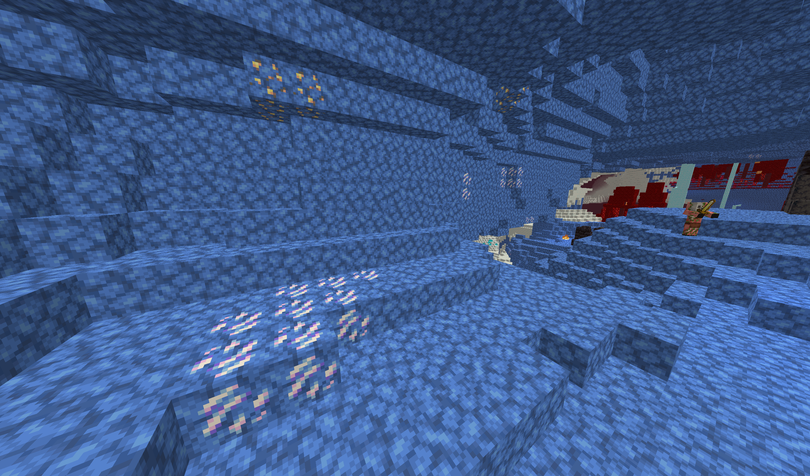
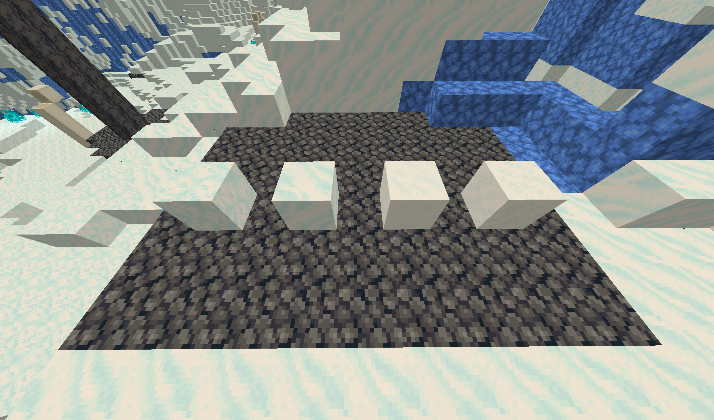
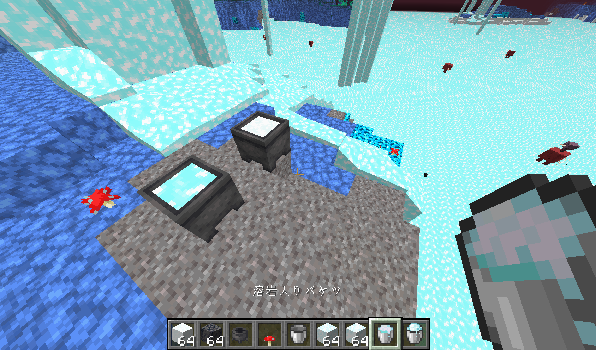
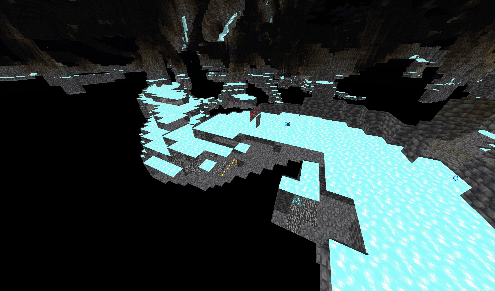

# BlueNether

ネザーが青くなるリソースパックです。ネザーラック系のブロック(ネザーレンガを除く)は青く、ソウル系のブロックは白くなり、氷と雪のような見た目になります。また、溶岩とマグマブロックは水色になります。涼しげなネザーを楽しんでください。  

**\[ [Download](https://github.com/9min-packup/SnowVillagePack/releases) \]**

  

金鉱床とクォーツの見た目も変わります。  

ソウルサンドの谷は雪原のようになります。  

雪や粉雪ブロックとあまり見分けがつきません。  

真紅の森。  

歪んだ森。  

溶岩とマグマブロックは水色になります。これはオーバーワールドでも同じです。溶岩入りバケツと粉雪入りバケツの見た目が似ています。  

オーバーワールドの溶岩。  

 

---

[SnowballAlchemy](./../snowball_alchemy/index.md)  
[top](./../index.md)
