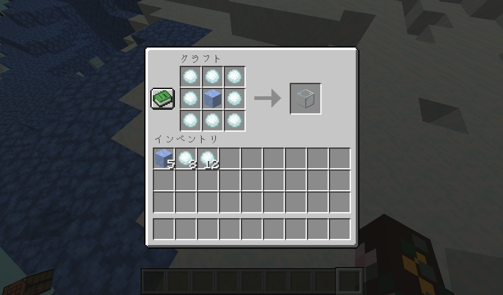
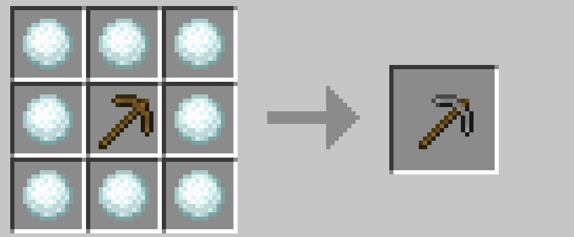

# SnowVllagePack

Minecraft 用に作成した、データパックとリソースパックのセットです。Java 版にのみ導入できます。

**\[ [Download](https://github.com/9min-packup/SnowVillagePack/releases) \]**

## [SnowballAlchemy](./snowball_alchemy/index.md)

雪玉を使用した、冒険を助けるカスタムレシピを追加します。短期間だけ遊ぶワールドでも、雪玉さえあれば資源を充実させることができます。 [詳細](./snowball_alchemy/index.md)

## [BlueNether](./blue_nether/index.md)

ネザーが青くなるリソースパックです。ネザーラック系のブロックは青く、ソウル系のブロックは白くなり、氷と雪のような見た目になります。また、溶岩とマグマブロックは水色になります。 [詳細](./blue_nether/index.md)

 

---

[SnowballAlchemy](./snowball_alchemy/index.md)  
[BlueNether](./blue_nether/index.md) 
