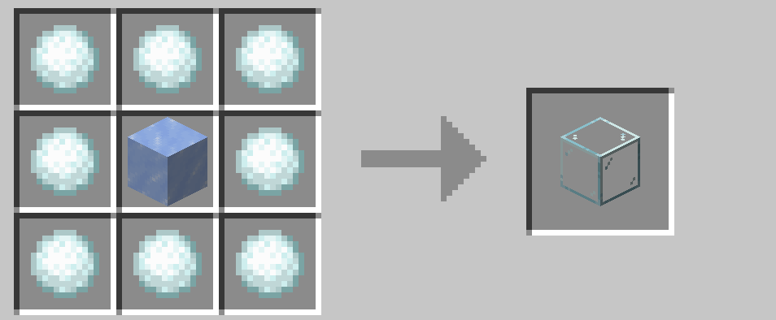
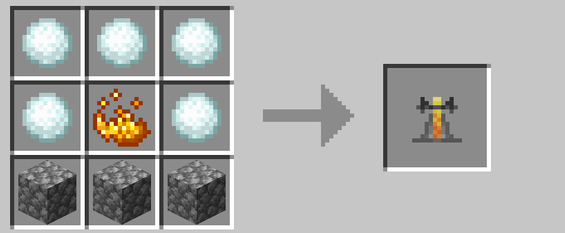

# 基本のレシピ

## アップグレード・変換

最も基本のレシピはアイテムを 8 つの雪玉で囲う形をしています。これは装備のアップグレードやアイテムの変換に用いられます。

 

## 魂の明かり

魂の明かり（魂のたいまつなど）を作る際にソウルサンドの代わりに使えます。また、レッドストーントーチのように雪玉を配置すると魂のたいまつをひとつ作ることができます。魂の明かりは通常の明かりから変換もできます。

 

## 宝石の代替

一部のレシピでは、希少な宝石の代わりに雪玉を使用できます。

 

## その他のレシピ

入手が難しいアイテムなどは特殊なレシピになっていることがあります。

 

→ <a href="./upgrade">装備のアップグレード</a>

 

 

---

[SnowballAlchemy](./index.md)  
[BlueNether](./../blue_nether/index.md) 
[top](./../index.md)
