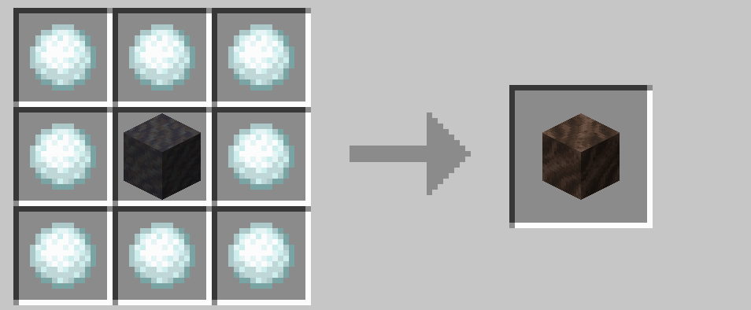
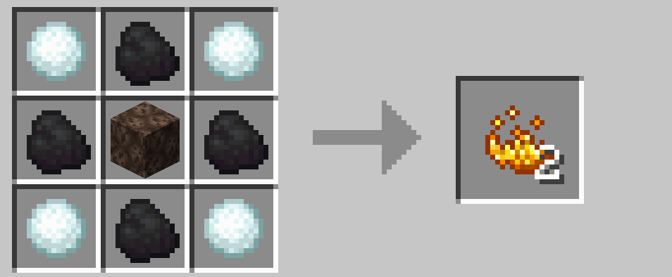
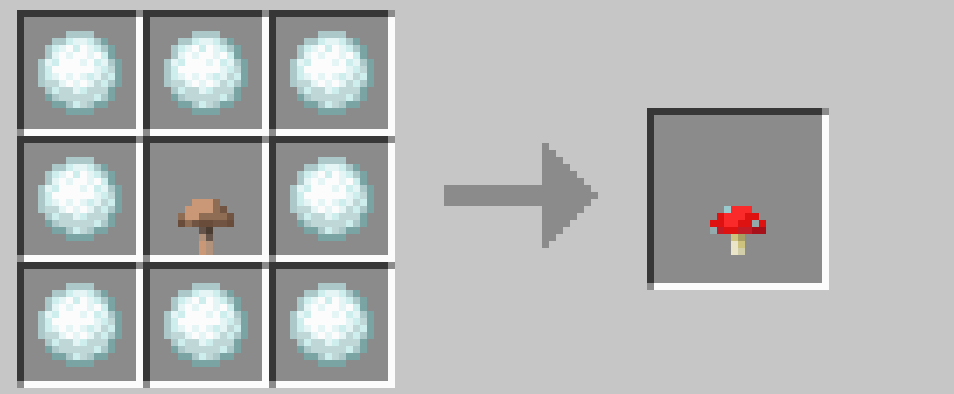
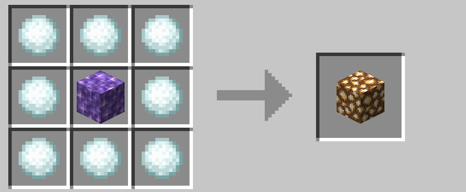

# 醸造関連

ネザーに行かなくても、ある程度の醸造ができるようになっています。

 

## ソウルサンド

泥をソウルソイルに、ソウルソイルをソウルサンドに変換できます。泥は土に水入り瓶を使うと作れます（通常の方法）ので、ネザーに行かなくてもソウルサンドを入手することが可能になっています。

  

## ガラス（ガラス瓶）

ガラス瓶を作るためのガラスは、氷を変換することで作ることができます。

  

## ブレイズパウダー

雪玉、石炭（または木炭）、ソウルサンドを使ってプレイズパウダーを作ることができます。ブレイズロッドは作ることができません。

ブレイズパウダーは醸造に使えますし、スライムボールと合わせてマグマクリームを作る（通常のレシピ）こともできます。

 

## 醸造台

ブレイズパウダーで醸造台を作ることができます。ブレイズロッドは不要です。

 

## ネザーウォート

茶色のキノコを赤色のキノコに、赤色のキノコをネザーウォートに変換できます。

 

## グロウストーン

アメジストブロックを変換することで、ネザーに行かなくてもグロウストーンを入手できます。グロウストーンからグロウストーンダストを入手すれば（通常の方法）醸造に利用できます。

 

## スライムブロック（マグマクリーム）

ハチミツブロックをスライムブロックに変換できます。分解してスライムボールにすれば（通常のレシピ）マグマクリームの原料になります。

 

→ <a href="./items.md">各種アイテム</a>

 

---

[SnowballAlchemy](./index.md)  
[BlueNether](./../blue_nether/index.md) 
[top](./../index.md)
