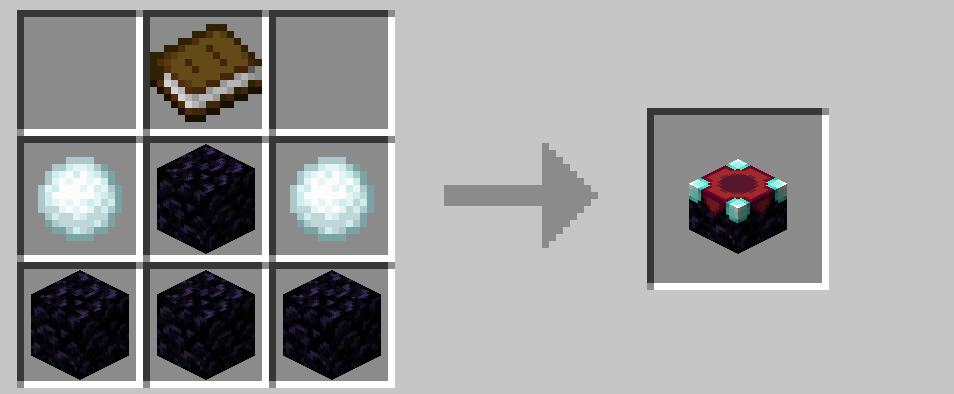
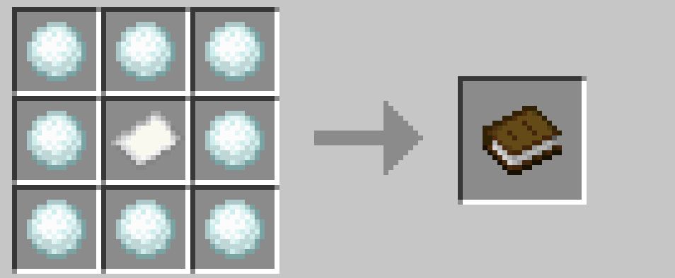
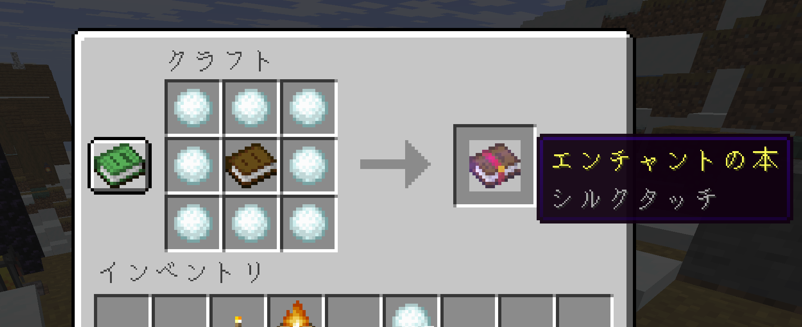

# エンチャント関連

## エンチャントテーブル

エンチャントテーブルを作る際に、ダイヤモンドの代わりに雪玉を使用できます。

 

## 本とシルクタッチ

紙を本に、本をシルクタッチのエンチャント本に変換できます。雪や氷を回収するのに役立ちそうですね。エンダーチェストを持ち歩くのにも使えます。

 

→ <a href="./redstone.md">レッドストーン関連</a>

 

---

[SnowballAlchemy](./index.md)  
[BlueNether](./../blue_nether/index.md) 
[top](./../index.md)
