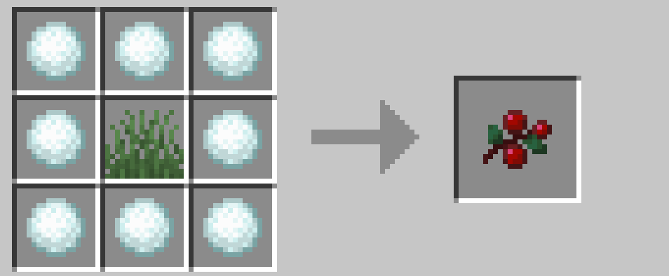
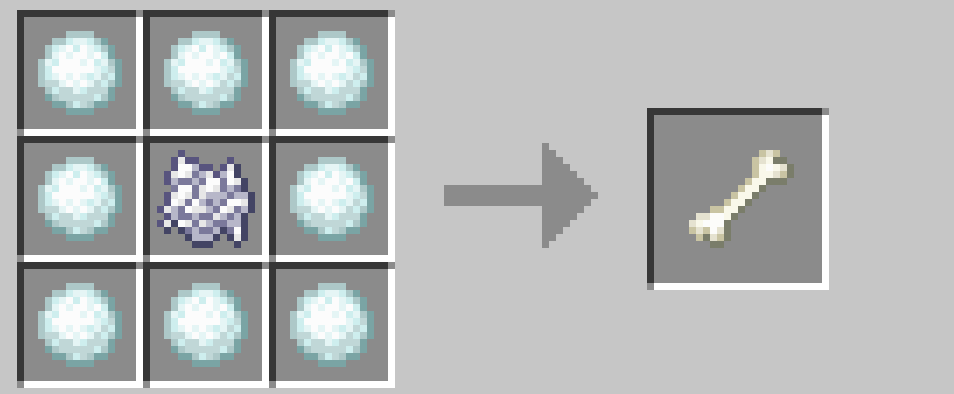

# 食べ物を得る

草をハサミで回収し、それをスイートベリーに変換できます。栽培することで序盤の飢えをしのぐことができるでしょう。あまり回復はしませんが、腐った肉を食べるよりはマシなはずです。キツネもきっと喜ぶでしょう。

 

残念ながら、小麦や肉などのおいしい植物を雪玉で増やすことはできません。ただ、 [アイテムを増やす](./increase_item.md) で説明しますが、骨粉を雪玉で（間接的に）増やすことはできます。骨が 1 本あればほどんどの食糧問題は解決するでしょう。

 

→ <a href="./increase_item">アイテムを増やす</a>

 

 

---

[SnowballAlchemy](./index.md)  
[BlueNether](./../blue_nether/index.md) 
[top](./../index.md)
