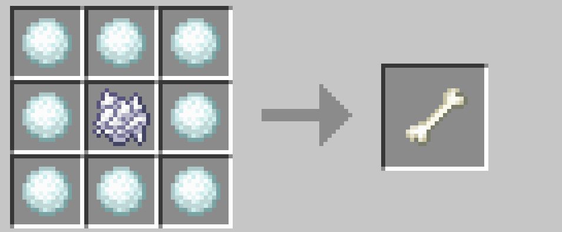

# アイテムを増やす

## 原石と宝石

下記の原石と宝石は、雪玉で鉱石に戻すことができます。（インゴットはできません。）

-   銅の原石

-   鉄の原石

-   金の原石

-   ラピスラズリ

-   レッドストーンダスト

 

さらに、それらの鉱石を雪玉で変換することで、通常ドロップするより少し多い数の原石あるいは宝石になります。ただし、幸運 Ⅲ のツルハシで鉱石を破壊するほうがより多く入手できますのでそちらをおすすめします。

 

このように、いくつかのアイテムでは

> 加工後 → 原料 → 加工後 → 原料 → ...

という変換を繰り返すことでアイテムを増やすことが可能になっています。

 

## 糸と羊毛

糸と羊毛を相互変換することで少しずつ増やすことができます。羊がガラスに閉じ込められる心配はもうありませんね。

 

## 革

革とウサギの皮についても相互変換することで増やすことが可能です。ウサギしかいない雪原でも革をたくさん集められそうです。

 

## 卵と羽

卵を経由して羽も増やすことができます。羽からは青い卵（雪国のニワトリが産む）のみ作れるようになっています。ニワトリはどこへ消えたのでしょうか。

 

## 骨と骨粉

骨粉を骨に復元できます。骨からは 3 つの骨粉が作れます（通常のレシピ）ので、繰り返すことで骨粉を増やすことが可能です。作物を育てるのに役立つでしょう。

 

## トウヒの原木

棒からトウヒの苗木、トウヒの苗木からトウヒの原木 4 つを作れます。原木から棒が作れます（通常のレシピ）ので、トウヒの原木に限り手軽に増やすことが可能です。木炭を得るのにも役立つでしょう。ただ、骨粉を使ってトウヒの大木を育てたほうが早いかもしれませんね。

 

→ <a href="./soulfire.md">魂の明かり</a>

 

---

[SnowballAlchemy](./index.md)  
[BlueNether](./../blue_nether/index.md) 
[top](./../index.md)
