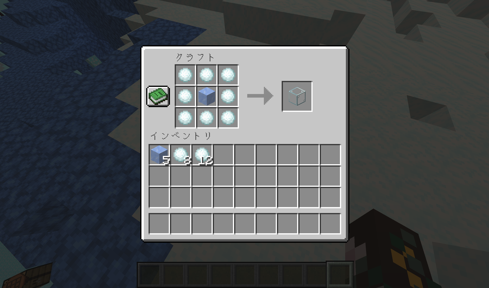
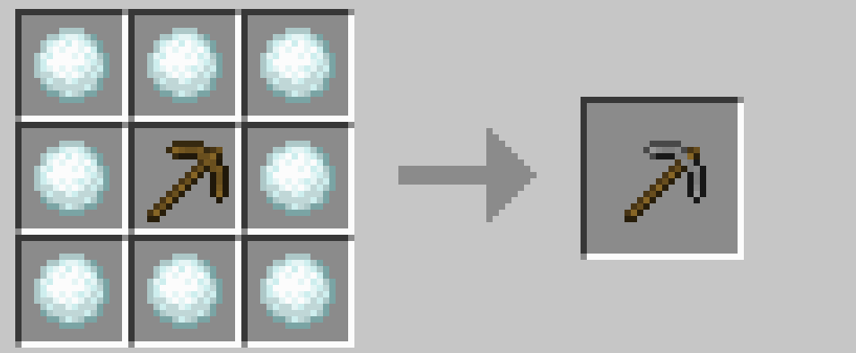

# SnowballAlchemy

SnowballAlchemy (雪玉錬金) は、雪玉を使用した、冒険を助ける多様なカスタムレシピを追加します。短期間だけ遊ぶワールドでも、雪玉さえあれば資源を充実させることができます。 

**\[ [Download](https://github.com/9min-packup/SnowVillagePack/releases) \]**

 

## 目次

### 1. [コンセプト](./../snowball_alchemy/concept.md)

### 2. [基本のレシピ](./../snowball_alchemy/basic_recipe.md)

### 3. [装備のアップグレード](./../snowball_alchemy/upgrade.md)

### 4. [食べ物を得る](./../snowball_alchemy/food.md)

### 5. [アイテムを増やす](./../snowball_alchemy/increase_item.md)

### 6. [魂の明かり](./../snowball_alchemy/soulfire.md)

### 7. [エンチャント関連](./../snowball_alchemy/enchant.md)

### 8. [レッドストーン関連](./../snowball_alchemy/redstone.md)

### 9. [醸造関連](./../snowball_alchemy/brewing.md)

### 10. [各種アイテム](./../snowball_alchemy/items.md)

 

---

[BlueNether](./../blue_nether/index.md) 
[top](./../index.md)
