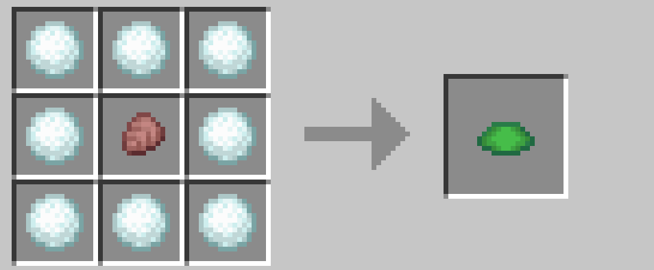

# 各種アイテム

## カメのウロコとプリズマリン（シーランタン）

アルマジロのウロコをカメのウロコに変換できます。

 

カメのウロコをプリズマリンの欠片に変換できます。

 

また、プリズマリンの欠片をプリズマリンクリスタルに変換できます。

プリズマリン系の素材でシーランタンを作れます（通常のレシピ）ので、建築で人気のシーランタンをアルマジロのウロコから作ることができます。

 

## 3 色のフロッグライト

シーランタンにマグマクリームを組み合わせることで新緑色のフロッグライトになります。そこにマグマクリームをさらに組み合わせることで黄土色のフロッグライトに、さらにマグマクリームを組み合わせることで最終的に真珠色のフロッグライトになります。マグマクリームを足すことで温度を上げていくようなイメージです。

通常のプレイであれば、マグマキューブをカエルに食べさせることでフロッグライトを入手できます。そのためにはカエルを育ててネザーに連れて行く必要があり、とても大変です。ですが使いやすい建材ですので、初心者でも作れるようにしました。

## 残響の欠片（リカバリーコンパス）

スカルクカタリストにアメジストの欠片を組み合わせることで残響の欠片になります。通常は古代都市でしか入手できないレアアイテムで、リカバリーコンパスの材料になります。

カジュアルなプレイヤーでもリカバリーコンパスの恩恵を得られるようにしました。スカルクカタリストはディープダークに生成されるほかウィーデンがドロップしますが、ウォーデンはとても強いので倒すのはおすすめしません。

 

## エンドストーンとコーラスフラワー

石とエンダーパールを組み合わせることでエンドストーンができます。

 

ツツジの花、または桜の花とエンダーパールを組み合わせることでコーラスフラワーができます。

コーラスフラワーをエンドストーンに植えて育てれば、エンドに行かなくてもエンドの建材を入手できます。

 

## ドラゴンの卵とドラゴンブレス

スニッファーの卵とエンダーパールを組み合わせることでドラゴンの卵ができます。スニッファーの卵は海底遺跡の怪しい砂から入手できます。

 

さらに、ドラゴンの卵と瓶を組み合わせることでドラゴンブレスができます。

ドラゴンの卵はただの装飾ブロックですが、ドラゴンブレスはポーションの材料になります。

 

## シュルカーの殻（シュルカーボックス）

カメの甲羅、ドラゴンブレス、ウィンドチャージを組み合わせることでシュルカーの殻になります。（ウィンドチャージは試練の間で入手できます。）シュルカーの殻はシュルカーボックスの材料になります。

シュルカーボックスは、中にアイテムを入れて持ち運べるとても便利なアイテムで、まさしくエンドコンテンツにふさわしい性能になっています。そのためクラフトに必要な素材はやや入手しにくいものにしました。

 

<a href="./index.md">一覧に戻る</a>

 

---

[SnowballAlchemy](./index.md)  
[BlueNether](./../blue_nether/index.md) 
[top](./../index.md)
