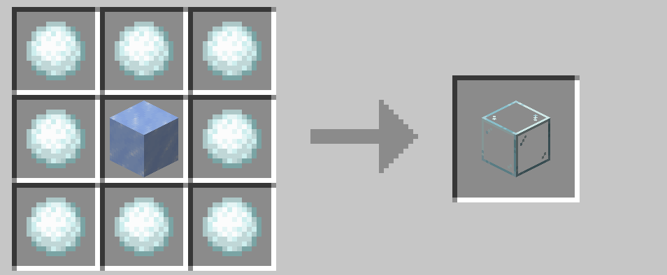

# レッドストーン関連

## レッドストーンコンパレーター

レッドストーンコンパレーターを作る際に、ネザークォーツの代わりに雪玉を使用できます。

## 日照センサー

日照センサーを作る際に、ネザークォーツの代わりに雪玉を使用できます。

 

また、ガラスは氷から作ることができます。

 

## スカルクセンサーと調律されたスカルクセンサー

日照センサーをスカルクセンサーに、スカルクセンサーを調律されたスカルクセンサーに変換できます。音を利用した装置に役立ちそうですね。

 

## ジュークボックス

ジュークボックスを作る際に、ダイヤモンドの代わりに雪玉を使用できます。アレイを増やすときにちょっと便利です。

 

## スライムブロック（粘着ピストン）

ハチミツブロックをスライムブロックに変換できます。分解してスライムボールにすれば（通常のレシピ）粘着ピストンの原料になります。

 

→ <a href="./brewing">醸造関連</a>

 

 

---

[SnowballAlchemy](./index.md)  
[BlueNether](./../blue_nether/index.md) 
[top](./../index.md)
