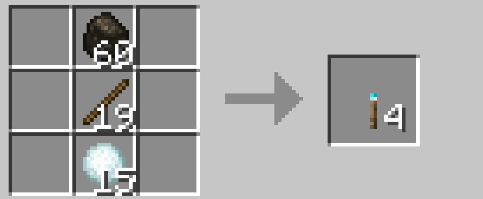
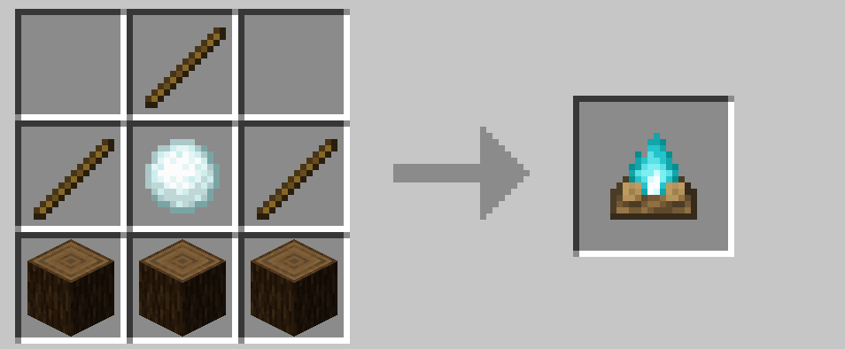
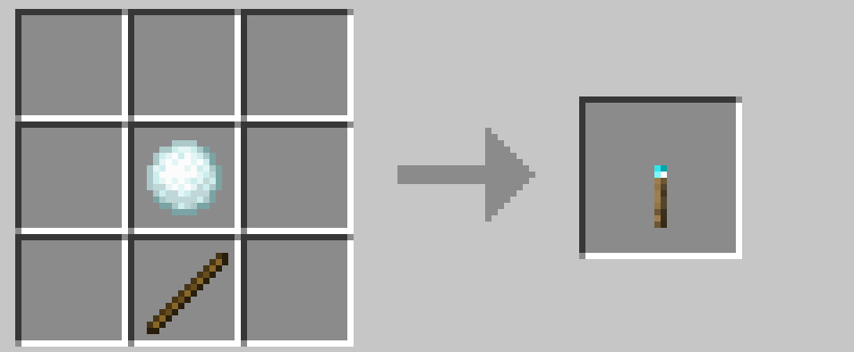
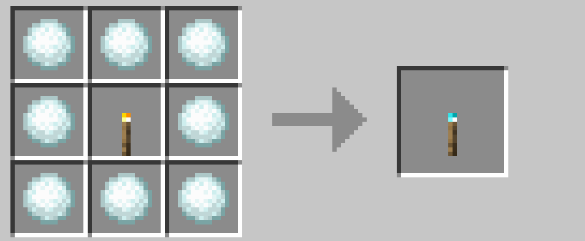
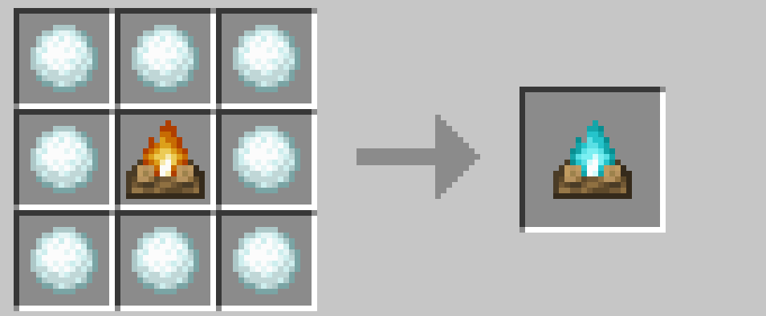
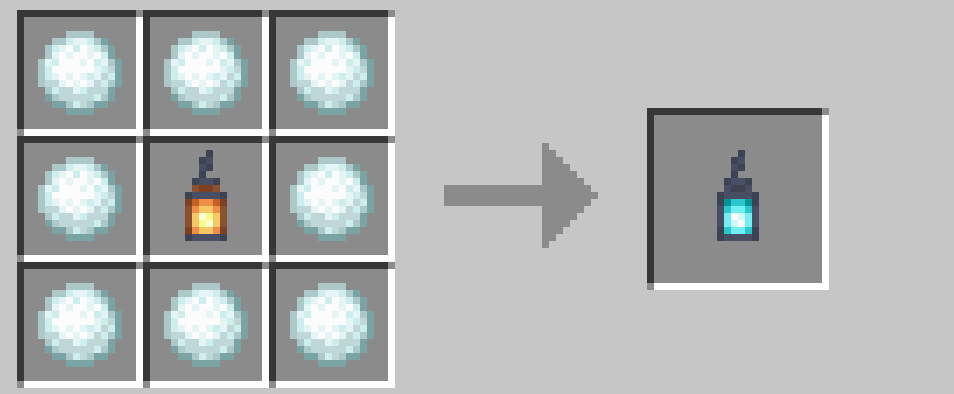

# 魂の明かり

魂のたいまつ、魂の焚き火を作る際に、ソウルサンドの代わりに雪玉を使えます。

 

また、レッドストーントーチのように雪玉を配置すると魂のたいまつをひとつ作ることができます。序盤に明かりがないときに役立ててください。

魂の明かりは通常の明かりから変換もできます。

 

 

→ <a href="./enchant">エンチャント関連</a>

 

 

---

[SnowballAlchemy](./index.md)  
[BlueNether](./../blue_nether/index.md) 
[top](./../index.md)
