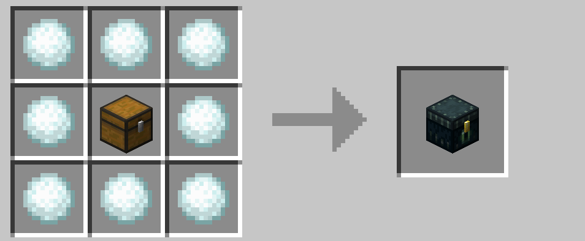

# 装備のアップグレード

剣やツルハシなどのツールは

> 木 → 石 → 鉄 → 金 → ダイヤモンド

のツールへとアップグレードでき、防具は

> 革 → チェーン → 鉄 → 金 → ダイヤモンド

へとアップグレードできます。

 

いずれもネザライトへはアップグレードできません。

 

これにより序盤の装備セットアップがすぐに終わります。裸でクリーパーに怯えながら洞窟で採掘をする必要はありません。

ただし、ダイヤモンド装備をクラフトできてもダイヤモンドそのものをクラフトすることはできないため、ダイヤモンド掘りの価値がなくなるわけではありません。あくまで序盤の行程をスキップする程度、と思ってください。

 

チェストをエンダーチェストにアップグレードでき、シルクタッチのツルハシ（[エンチャント関連](./enchant.md) で説明）があれば序盤からエンダーチェストを持ち歩くことができます。間違って別のツルハシで壊してしまったときも安心ですね。（これで黒曜石を増やすことができるのは内緒です。）

 

→ <a href="./food">食べ物を得る</a>

 

 

---

[SnowballAlchemy](./index.md)  
[BlueNether](./../blue_nether/index.md) 
[top](./../index.md)
